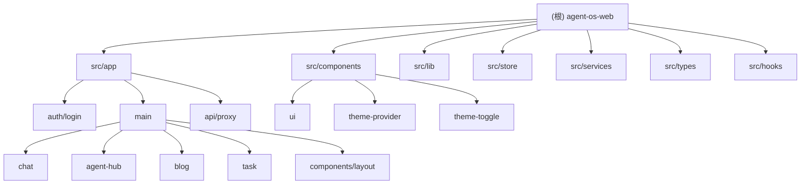

# Agent OS Web

> Personal Operating System for PoulCore - 一个智能化的个人操作系统前端应用

## 项目愿景

Agent OS Web 是 Agent OS 生态系统的前端界面，旨在为用户提供一个优雅、智能的个人操作系统体验。系统集成了 AI 对话、智能体管理、任务执行控制台、博客撰写等核心功能，采用现代化的技术栈和精致的 UI 设计。

## 架构总览

本项目是一个 **Next.js 16** 单体前端应用，采用 **App Router** 架构，通过 API 代理层与后端 Java 服务通信。

### 技术栈

| 层级 | 技术选型 |
|------|----------|
| 框架 | Next.js 16 (App Router) |
| 语言 | TypeScript 5 |
| UI 库 | React 19 |
| 样式 | Tailwind CSS 4 |
| 组件库 | Radix UI (shadcn/ui 风格) |
| 状态管理 | Zustand 5 (持久化存储) |
| 图标 | Lucide React |
| Markdown | react-markdown + remark-gfm |
| 主题 | next-themes (深色/浅色切换) |
| 包管理 | pnpm |

### 目录结构

```
src/
  app/                    # Next.js App Router
    api/proxy/[...path]/  # 后端 API 代理
    auth/login/           # 登录模块
    main/                 # 主应用区域
      components/layout/  # 布局组件 (Sidebar, TopBar)
      agent-hub/          # 智能体中心
      blog/               # 博客模块
      chat/               # 对话模块
      task/               # 任务执行控制台
  components/
    theme-provider.tsx    # 主题提供者
    theme-toggle.tsx      # 主题切换组件
    ui/                   # 基础 UI 组件 (Radix UI 封装)
  hooks/                  # 自定义 Hooks
    useAuth.ts            # 认证 Hook
  services/               # API 服务层
    auth.service.ts       # 认证服务
    chat.service.ts       # 聊天服务
  store/                  # Zustand 状态管理
    auth.ts               # 认证状态
    sidebar.ts            # 侧边栏状态
  types/                  # TypeScript 类型定义
    auth.ts               # 认证类型
    conversation.ts       # 对话类型
    task.ts               # 任务类型
    agent.ts              # 智能体类型
  lib/
    http.ts               # HTTP 请求封装
    utils.ts              # 工具函数
```

## 模块结构图



## 模块索引

| 模块 | 路径 | 职责 | 入口文件 |
|------|------|------|----------|
| 登录认证 | `src/app/auth/login` | 用户登录、Token 管理 | `page.tsx` |
| 对话系统 | `src/app/main/chat` | AI 对话、会话管理、消息渲染 | `layout.tsx` |
| 智能体中心 | `src/app/main/agent-hub` | Agent 配置、Prompt 管理、MCP 工具绑定 | `page.tsx` |
| 任务控制台 | `src/app/main/task` | 任务执行、执行时间线、历史记录、执行控制 | `page.tsx` |
| 博客系统 | `src/app/main/blog` | 博客文章展示 | `page.tsx` |
| API 代理 | `src/app/api/proxy` | 后端请求转发、统一代理 | `route.ts` |
| 布局组件 | `src/app/main/components/layout` | 侧边栏、顶部栏、折叠控制 | `AppSidebar.tsx`, `AppTopBar.tsx` |
| UI 组件库 | `src/components/ui` | 基础 UI 组件封装 | - |
| 状态管理 | `src/store` | Zustand 全局状态 | `auth.ts`, `sidebar.ts` |
| 服务层 | `src/services` | API 服务封装 | `auth.service.ts`, `chat.service.ts` |
| 类型定义 | `src/types` | TypeScript 类型 | `auth.ts`, `conversation.ts`, `task.ts`, `agent.ts` |
| Hooks | `src/hooks` | 自定义 React Hooks | `useAuth.ts` |
| 工具库 | `src/lib` | HTTP 请求、工具函数 | `http.ts`, `utils.ts` |

## 运行与开发

### 环境要求

- Node.js >= 18
- pnpm (推荐)

### 环境变量

创建 `.env.local` 文件：

```env
BACKEND_JAVA_URL=http://localhost:8080/api
DEBUG_PROXY=true
```

### 常用命令

```bash
# 安装依赖
pnpm install

# 开发模式
pnpm dev

# 构建生产版本
pnpm build

# 启动生产服务
pnpm start

# 代码检查
pnpm lint
```

### 路由结构

| 路径 | 页面 | 访问控制 |
|------|------|----------|
| `/` | 根页面 (自动跳转) | Token 检测 |
| `/auth/login` | 登录页 | 公开 |
| `/main` | 主页 | 需登录 |
| `/main/chat` | 对话 | 需登录 |
| `/main/task` | 任务控制台 | 需登录 |
| `/main/agent-hub` | 智能体中心 | 需登录 |
| `/main/blog` | 博客 | 需登录 |
| `/main/blog/[slug]` | 博客详情 | 需登录 |
| `/main/log` | 日志 (待实现) | 需登录 |
| `/main/knowledge-base` | 知识库 (待实现) | 需登录 |

## 测试策略

**当前状态**: 项目尚未配置测试框架。

**建议补充**:
- 单元测试: Jest + React Testing Library
- E2E 测试: Playwright
- 组件测试: 对 Chat 模块、Task 模块和 Agent Hub 的核心组件进行测试

## 编码规范

### 代码风格

- TypeScript strict 模式
- ESLint: `eslint-config-next` (TypeScript + Web Vitals)
- 使用 `"use client"` 标记客户端组件

### 命名约定

| 类型 | 约定 | 示例 |
|------|------|------|
| 组件文件 | PascalCase | `ChatBubble.tsx` |
| 页面文件 | 小写 | `page.tsx`, `layout.tsx` |
| 工具函数 | camelCase | `httpGet`, `cn` |
| 接口/类型 | PascalCase | `Conversation`, `Message` |
| 服务文件 | kebab-case + .service | `auth.service.ts` |
| Store 文件 | camelCase | `auth.ts`, `sidebar.ts` |

### HTTP 请求规范

使用 `src/lib/http.ts` 封装的请求方法：

```typescript
import { httpGet, httpPost, httpPut, httpDelete } from "@/lib/http";

// GET 请求
const data = await httpGet<ResponseType>("/api/proxy/endpoint");

// POST 请求
const result = await httpPost<ResponseType>("/api/proxy/endpoint", payload);
```

**统一响应结构**:

```typescript
interface Result<T> {
  code: string;    // "2000" = 成功, "4001" = Token 失效
  message: string;
  data: T;
}
```

**Token 失效处理**: HTTP 封装会自动检测 `code === "4001"` 并跳转登录页。

### 状态管理规范

使用 Zustand 进行全局状态管理，支持持久化存储：

```typescript
import { useAuthStore } from "@/store/auth";
import { useSidebarStore } from "@/store/sidebar";

// 在组件中使用
const token = useAuthStore((state) => state.token);
const { isCollapsed, toggle } = useSidebarStore();
```

### 服务层规范

API 调用应封装在 `src/services/` 目录下：

```typescript
// src/services/chat.service.ts
import { httpGet, httpPost } from '@/lib/http';

export const chatService = {
  getList: () => httpGet<Conversation[]>('/api/proxy/chat/conversations'),
  sendMessage: (id: number, content: string) =>
    httpPost<string>(`/api/proxy/chat/conversations/${id}/messages`, { content }),
};
```

### UI 设计规范

- 主题色: `#4ef2c2` (薄荷绿)
- 深色背景: `oklch(0.145 0 0)`
- 卡片背景: `oklch(0.205 0 0)`
- 支持深色/浅色主题切换 (通过 next-themes)
- 使用 Tailwind CSS 的 `cn()` 函数合并类名
- 遵循 Radix UI 的可访问性最佳实践

## AI 使用指引

### 适合 AI 辅助的任务

1. **新增页面/路由** - 遵循现有的 App Router 结构
2. **添加 UI 组件** - 参考 `src/components/ui/` 现有组件风格
3. **API 集成** - 使用 `src/lib/http.ts` 封装，在 `src/services/` 中定义服务
4. **样式调整** - 使用 Tailwind CSS
5. **状态管理** - 使用 Zustand，在 `src/store/` 中定义

### 关键文件说明

| 文件 | 说明 |
|------|------|
| `src/store/auth.ts` | 认证状态管理 (Zustand + persist) |
| `src/store/sidebar.ts` | 侧边栏折叠状态 (Zustand + persist) |
| `src/lib/http.ts` | HTTP 请求核心封装，从 Zustand store 获取 Token |
| `src/hooks/useAuth.ts` | 认证 Hook，封装登录/登出逻辑 |
| `src/services/auth.service.ts` | 认证 API 服务 |
| `src/services/chat.service.ts` | 聊天 API 服务 |
| `src/types/` | 全局类型定义 |
| `src/app/api/proxy/[...path]/route.ts` | 后端代理，所有 `/api/proxy/*` 请求转发到后端 |
| `src/app/main/layout.tsx` | 主布局，定义侧边栏 + 顶栏 + 内容区结构，支持侧边栏折叠 |
| `src/app/globals.css` | 全局样式，定义 CSS 变量和深/浅色主题 |
| `src/components/theme-provider.tsx` | 主题提供者 (next-themes 封装) |
| `src/components/theme-toggle.tsx` | 主题切换组件 |

### 开发注意事项

1. 所有后端请求必须通过 `/api/proxy/` 前缀
2. Token 存储在 Zustand store (`auth-storage` localStorage key)
3. 根页面 `/` 会根据 Token 自动跳转
4. Chat 模块的 `layout.tsx` 管理会话状态，`page.tsx` 为空
5. 侧边栏折叠状态存储在 Zustand store (`sidebar-storage` localStorage key)
6. Task 模块的历史记录存储在 `localStorage.task_history`
7. 新增 API 应在 `src/services/` 中创建对应的服务文件
8. 新增全局类型应在 `src/types/` 中定义

## 变更记录 (Changelog)

### 2026-03-22 - 引入 Zustand 统一状态管理

- **重大架构变更**: 引入 Zustand 替代 localStorage 直接操作
  - 新增 `src/store/auth.ts` - 认证状态管理
  - 新增 `src/store/sidebar.ts` - 侧边栏状态管理
  - 支持状态持久化 (localStorage)
- **新增服务层**: `src/services/`
  - `auth.service.ts` - 认证 API 封装
  - `chat.service.ts` - 聊天 API 封装
- **新增类型系统**: `src/types/`
  - `auth.ts` - 认证相关类型
  - `conversation.ts` - 对话相关类型
  - `task.ts` - 任务相关类型
  - `agent.ts` - 智能体相关类型
- **新增 Hooks 层**: `src/hooks/`
  - `useAuth.ts` - 认证 Hook，封装登录/登出逻辑
- **更新 HTTP 封装**: `src/lib/http.ts` 从 Zustand store 获取 Token
- **更新登录页**: 使用 `useAuth` Hook 替代直接操作 localStorage
- **更新根页面**: 使用 Zustand store 检测登录状态
- 新增模块文档: `src/store/CLAUDE.md`, `src/services/CLAUDE.md`, `src/types/CLAUDE.md`

### 2026-03-21 - 增量更新

- 新增 Task 模块（任务执行控制台）
  - 支持任务输入、执行时间线展示、结果渲染
  - 支持三种执行模式：Autonomous / Guided / Manual
  - 支持历史任务记录和详情查看
- 布局组件迁移至 `src/app/main/components/layout/`
  - 新增 `SidebarContext.tsx` 支持侧边栏折叠
  - 更新 `AppSidebar.tsx` 支持折叠/展开动画
  - 新增 Tooltip 提示（折叠状态下）
- 新增主题切换功能
  - 集成 `next-themes`
  - 新增 `theme-provider.tsx` 和 `theme-toggle.tsx`
  - 支持深色/浅色/跟随系统三种模式
- Blog 详情页 `[slug]/page.tsx` 已实现基础版本
- 更新全局样式，支持深色/浅色主题 CSS 变量
- 更新模块结构图和索引

### 2026-03-19 - 初始化 AI 上下文

- 创建根级 `CLAUDE.md`
- 创建各模块级 `CLAUDE.md`
- 生成 `.claude/index.json` 索引文件
- 完成项目架构扫描与文档化
